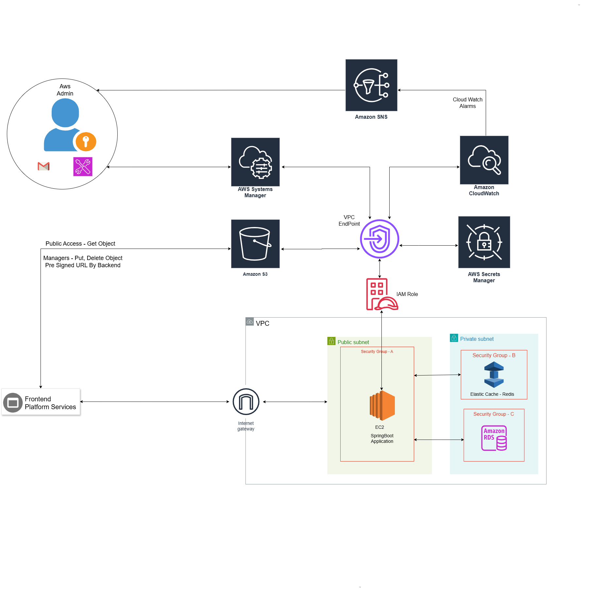

# Hotel Management & Booking System — Cloud Architecture

AWS cloud architecture for a full-stack Hotel Management & Booking System. This repo documents infrastructure design, decisions, and operational setup — application code lives in separate frontend/backend repos (linked below).

First AWS project. Background is backend (Spring Boot); AWS and networking were new going in. This is **v1 of a 3-part roadmap** — see [Roadmap](#roadmap).

Infrastructure is currently provisioned manually via the AWS Console. No IaC (Terraform/CDK) yet — noted here explicitly rather than implied.

---

## Repos

- Frontend: [BookMyStay](https://github.com/Abhishekkhode/BookMyStay)
- Backend: [BookMyStay-BackendService](https://github.com/Abhishekkhode/BookMyStay-BackendService)
- Deployed : [BookMyStay](https://bookmystay-one.vercel.app/)
- This repo: architecture, decisions, docs
---

## Table of Contents

- [Architecture Overview](#architecture-overview)
- [Tech Stack](#tech-stack)
- [Security & Networking](#security--networking)
- [Observability](#observability)
- [What v1 Intentionally Does Not Include](#what-v1-intentionally-does-not-include)
- [Decisions](#decisions)
- [Cost](#cost)
- [Roadmap](#roadmap)

---

## Architecture Overview



```
User Browser
     │
     ▼
Vercel (React/Vite SPA)
     │ HTTPS
     ▼
VPC
├── Public Subnet
│   └── EC2 (t3.micro) — Spring Boot API, systemd
│
└── Private Subnets
    ├── RDS PostgreSQL (Single-AZ)
    └── ElastiCache Redis (Serverless)

Outside VPC ( via VPC Endpoints):
S3 · Secrets Manager · SSM Parameter Store · CloudWatch · SNS · IAM
```

Full diagram + source file: [`architecture/`](./architecture)

---

## Tech Stack

| Layer            | Technology                     |
| ---------------- | ------------------------------ |
| Frontend         | React (Vite) on Vercel         |
| Backend          | Java Spring Boot               |
| Database         | RDS (PostgreSQL)               |
| Cache / Sessions | ElastiCache Serverless (Redis) |
| Object Storage   | S3                             |
| Compute          | EC2 (t3.micro)                 |
| Secrets          | Secrets Manager                |
| Config           | SSM Parameter Store            |
| Observability    | CloudWatch, SNS                |
| Endpoint         | VPC Endpoints                  |

---

## Security & Networking

- RDS and Redis in private subnets, no public IPs.
- Inbound access scoped to security-group references, not CIDR/IP rules.
- No hardcoded credentials — secrets resolved from Secrets Manager / SSM at instance boot.
- IAM role scoped to least-privilege permissions for the specific resources the app uses.
- S3 CORS restricted to known origins (Vercel + local dev).
- Known v1 gap: EC2 instance is in a public subnet. See [ADR-003](./adr/003-public-subnet-v1-tradeoff.md).
- VPC Endpoints for internal Traffic routing

---

## Observability

- CloudWatch Agent streaming app + system logs from EC2.
- Custom metrics for memory and disk (not collected by default).
- CloudWatch Alarms → SNS email on CPU, memory, disk, and low RDS storage thresholds.

Screenshots: [`screenshots/`](./screenshots)

---

## What v1 Intentionally Does Not Include

- Application Load Balancer
- Auto Scaling Group
- Multi-AZ RDS
- Private subnet for the application server
- AWS WAF

Scoped for v3, once load testing (v2) shows what's actually needed. Not oversights — see [Roadmap](#roadmap).

---

## Decisions

Short, focused write-ups on individual tradeoffs: [`adr/`](./adr)

| ADR                                              | Decision                                  |
| ------------------------------------------------ | ----------------------------------------- |
| [001](./adr/001-presigned-s3-uploads.md)         | Direct-to-S3 uploads via pre-signed URLs  |
| [002](./adr/002-sg-references-over-cidr.md)      | Security-group references over CIDR rules |
| [003](./adr/003-public-subnet-v1-tradeoff.md)    | Public subnet for EC2 in v1               |
| [004](./adr/004-secrets-manager-vs-ssm-split.md) | Secrets Manager + SSM split               |
| [005](./adr/005-single-az-rds-v1.md)             | Single-AZ RDS in v1                       |

---

## Cost

Approximate, informally tracked during development — not benchmarked. See [`cost/cost-breakdown.md`](./cost/cost-breakdown.md) for the full table and caveats.

---

## Roadmap

| Version | Focus                                             | Status     |
| ------- | ------------------------------------------------- | ---------- |
| v1      | VPC, security groups, IAM, secrets, observability | ✅ Current |
| v2      | Load testing with k6 to find real bottlenecks     | 🔜 Next    |
| v3      | ALB, ASG, Multi-AZ RDS, private app subnet, WAF   | 📋 Planned |

---


## Connect with Me

**Abhishek Khode**

 [LinkedIn Profile](https://www.linkedin.com/in/abhishek-khode-1650372a0/)
---